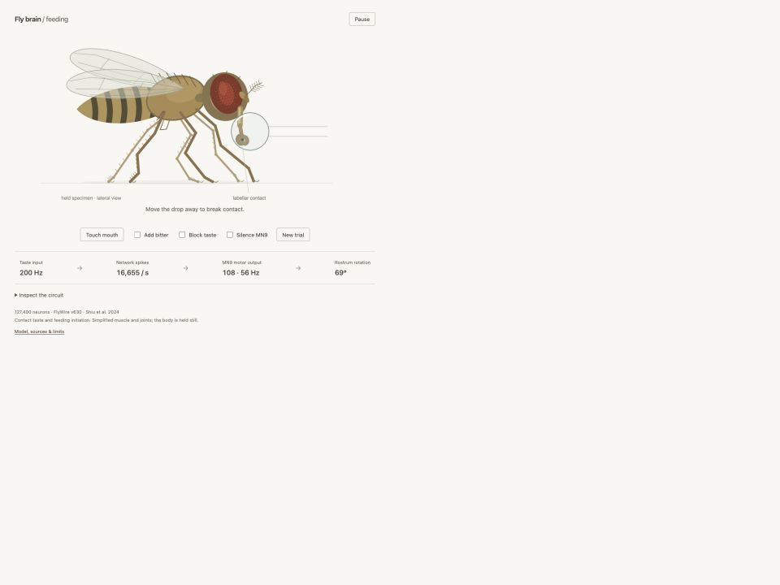

# Fly brain / feeding

A contact-taste experiment in your browser. A held fruit fly extends its proboscis through the original Shiu et al. neural model, using all **127,400 neurons and 14,687,178 directed connections** from its FlyWire v630 dataset. The muscle and joints are simplified.

## Start Here

**[Open the live experiment](https://dicnunz.github.io/fly-brain-feeding/)**, then drag the drop to the fly’s mouth or click **Touch mouth**. The first load includes a 61 MB neural-data script.

To keep an offline copy, **[download fly-brain-feeding.zip](https://github.com/dicnunz/fly-brain-feeding/releases/latest/download/fly-brain-feeding.zip)**. Double-click the ZIP to extract it, open the **fly-brain-feeding** folder, then double-click **index.html**. Keep the other files in that folder. It is designed for direct opening in a current browser; that exact opening method remains unverified. Use the live link above for the verified starting path.

No GitHub account, Git, terminal, installation, paid service or remote inference is needed to use the experiment. This repository is simply the project folder and its supporting files. You can ignore GitHub’s Code menu, branches, commits, Issues and Actions.

## What the fly does

The drop activates identified labellar sugar receptors only when it touches the moving mouthparts. Their spikes pass through the actual signed, recurrent network. Spikes in the two MN9 motor neurons drive a damped protractor joint. That joint changes the mouth’s position, which changes contact and the next sensory input.

- **Add bitter** stimulates the authors’ bitter receptor population alongside sugar. Suppression of MN9 is computed inside the network.
- **Block taste** removes external stimulation. Existing neural activity can decay.
- **Silence MN9** clamps those motor neurons at rest. Upstream taste activity continues while the proboscis returns to rest.
- **Inspect the circuit** shows real spike events and live performance measurements.
- **New trial** restores the resting model with a different random seed. Arrow keys move the droplet when the fly view is focused; Enter touches the mouth.

The body is held still, as in a feeding preparation. Walking, flight, grooming, ingestion, hunger and learning are absent. No prerecorded trajectories or learned motor policies control the proboscis.

## What is modeled, and what is assumed

**Anatomy:** the complete graph distributed with [Shiu et al., Nature 2024](https://www.nature.com/articles/s41586-024-07763-9), pinned to their original female FlyWire v630 materialization. Its directed edges preserve 52,793,639 anatomical synapse counts, author-assigned signs and every neuron identity. No neurons, connections or recurrent paths were pruned or aggregated. Newer FlyWire, BANC and MaleCNS reconstructions are distinct datasets and are not mixed into this specimen.

**Neural dynamics:** identical leaky integrate-and-fire cells, with the authors’ time constants, reset, delay, refractory behavior and fitted synaptic gain. These are assumptions imposed on static anatomy. The solver uses 0.1 ms steps and analytic subthreshold transitions; an analytic threshold bound lets dormant neurons retain their state without unnecessary computation. No weights are trained.

**Sensation:** physical contact supplies stochastic 200 Hz stimulation to 21 sugar neurons and, optionally, 21 bitter neurons. That contact-to-rate conversion is illustrative, not a measured receptor or concentration model. Vision, smell and other senses receive no input.

**Movement:** real MN9 spikes provide the only protraction drive. The anatomical role follows [McKellar et al., eLife 2020](https://elifesciences.org/articles/54978). Muscle gain, damping, spring return, drawing proportions and two-joint coupling are explicitly phenomenological. Boundary-contact oscillations arise from this modeled feedback loop; they are not validated feeding rhythms.

This is **not a complete functioning fly brain or a biologically exact digital animal**. It omits cell-specific physiology, graded signaling, gap junctions, receptor-specific transmission, neuromodulation, plasticity, metabolism and spontaneous activity. Whole-network inclusion is a statement about the supplied model’s graph, not whole-animal biological fidelity.

[Model, sources and limits](https://dicnunz.github.io/fly-brain-feeding/about.html) · [Research and correspondence](docs/model-evidence.md) · [Validation](docs/validation.md)

## Files and verification

`index.html` opens the experiment. `model.js` computes neurons; `body.js` computes the mechanical readout; `app.js` connects them in a worker; `draw.js` renders the same body state. `data/` contains the complete offline graph, exact source hashes and attribution. `tools/prepare_data.py` reproduces the lossless packing from pinned source files.

For developers, `node --test tests/*.test.cjs` runs the numerical, whole-network and closed-loop tests. No npm dependencies or build step are required. Tests compare the solver against dense integration and a Brian2 reference fixture, then check sensory and motor interventions on the actual dataset. Browser interaction and performance measurements are recorded separately in [validation](docs/validation.md).

## Attribution and reuse

Independent adaptation; no affiliation or endorsement. Source anatomy: [Dorkenwald et al.](https://www.nature.com/articles/s41586-024-07558-y), [Schlegel et al.](https://www.nature.com/articles/s41586-024-07686-5), and the FlyWire Consortium. Model: [Shiu and colleagues](https://github.com/philshiu/Drosophila_brain_model). Proboscis anatomy: McKellar and colleagues. The illustration is original; no scientific figures or third-party meshes are bundled.

Original code and drawing: [MIT](LICENSE). The authors’ exact model files carry an MIT archive notice, while general FlyWire public-data guidelines specify CC BY-NC 4.0. Both notices are retained in [data/LICENSE](data/LICENSE). **Treat reuse of the included connectome as noncommercial.** The code license does not override data terms.
